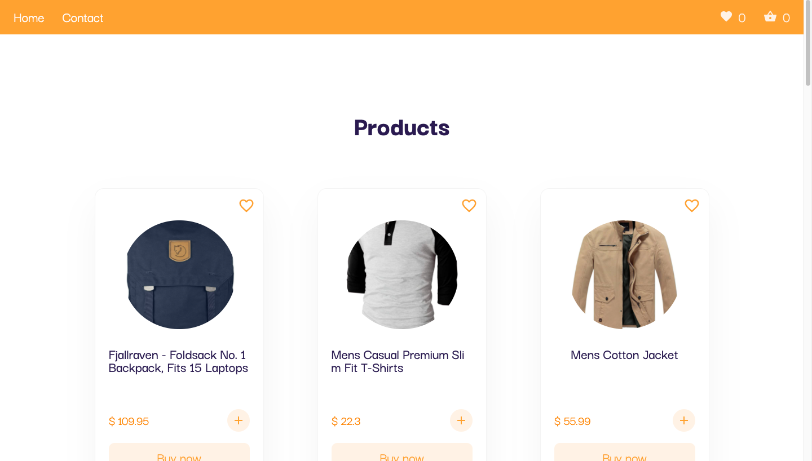

## React E-Commerce App

https://e-commerce-app-patikadev.netlify.app/

## Project Source Code

https://github.com/metehankasapp/e-commerce-app-patika.dev

## Screenshot

## Application usage:

### `npm install`
### `npm start`

### Built with

- React.js
- Redux, redux-toolkit
- Semantic HTML5 markup
- CSS custom properties
- Flexbox
- Responsive Design
- Material UI for Design
- Formik for form
- React Router for url sync.
- Axios for requests
- yup for validate form

## Fake Store API

https://fakestoreapi.com/docs

## Author

- Website - [Metehan Kasap](https://metehannkasap.web.app)
- LinkedIn - [Metehan Kasap](https://www.linkedin.com/in/metehan-kasap-a0b021203/)
- Twitter - [@5steellix8](https://www.twitter.com/5steellix8)

